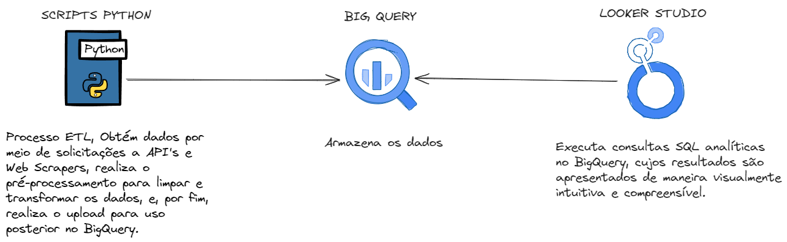
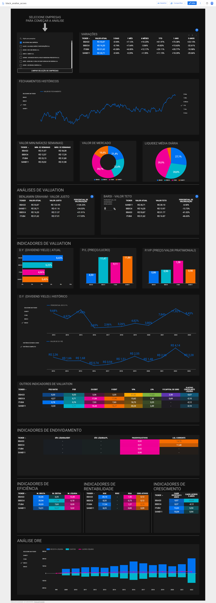

## Objetivo
O propósito deste projeto é criar uma aplicação de dados que emprega os princípios de engenharia, análise e visualização de dados. A intenção é proporcionar suporte à tomada de decisões no contexto da negociação de ações na bolsa de valores brasileira.

## Resumo geral do projeto 
<b>Resumo:</b>

  
  <b>Fluxo de processo</b>

O processo se inicia com scripts em Python que realizam solicitações para acessar dados na [API brapi](https://brapi.dev/), ou em Web Scrapers e APIs dos sites [Status Invest](https://statusinvest.com.br/) e [Investidor 10](https://investidor10.com.br/). Nestes scripts em Python, os dados obtidos passam por um pré-processamento para limpeza e transformação, sendo em seguida carregados no BigQuery, onde são armazenados. O Looker Studio utiliza, então, consultas SQL personalizadas no BigQuery, aplicando conceitos analíticos e uma transformação específica para apresentar os dados de acordo com os padrões ideais de visualização definidos para o projeto, considerando as limitações da ferramenta de visualização de dados utilizada, como a filtragem de dados históricos por períodos específicos, por exemplo.

## Stacks
Python - Linguagem de programação para scripts que realizam o processo ETL. 
BigQuery - Serviço de armazenamento e análise de dados na nuvem. 
Looker Studio - Plataforma de Business Intelligence (BI) para visualização de dados. 
SQL - Linguágem de bancos de dados das consultas estruturadas. 
Figma - Plataforma de design utilizada no fundo da visualização de dados.

## Resultados
Como evidenciado no vídeo abaixo, o resultado do projeto foi altamente satisfatório. De maneira rápida e objetiva, tornou-se possível analisar diversas ações simultaneamente em uma plataforma de Business Intelligence (BI), além de incorporar indicadores e métricas de mercado. Adicionalmente, foi implementado o cálculo automático das Análises de Valuation de investidores renomados e bem-sucedidos no mercado de ações, como, por exemplo, a análise de preço justo de [Benjamin Graham](https://pt.wikipedia.org/wiki/Benjamin_Graham) e o preço-teto de [Luiz Barsi Filho](https://www.infomoney.com.br/perfil/luiz-barsi/).

<b>Video apresentação:</b> 

 
<b> Imagem dashboard final:</b>

  
  <b>DashBoard</b>

Os códigos Python, as consultas SQL estruturadas de maior complexidade apenas, e o design de background criado no Figma estão disponíveis nos arquivos do repositório.

## Conclusão
Por meio da integração de diversas tecnologias e conceitos técnicos, este projeto ilustra parte da minha expertise na aplicação eficaz da inteligência de dados, com engenharia, análise e visualização de dados. Sinto-me confiante em ter obtido um desempenho satisfatório, cumprindo com sucesso o propósito inicialmente estabelecido. Almejo que este trabalho contribua para disseminar conhecimento, mas também inspire a entrada de novos investidores na bolsa de valores.